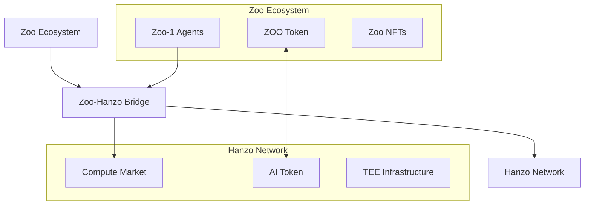

# ZIP-001: Hanzo Network Integration for Zoo Ecosystem

**ZIP Number**: 001
**Title**: Hanzo Network Integration for Zoo Ecosystem
**Author**: Zoo Labs Foundation
**Status**: Draft
**Type**: Standards Track
**Created**: 2024-12-19

## Abstract

This ZIP specifies how Zoo ecosystem integrates with Hanzo Network for decentralized compute, enabling Zoo-1 agents to leverage multi-tier simulation and confidential computing.

## Motivation

Zoo ecosystem needs:
1. Scalable compute for agent simulations
2. Confidential execution for sensitive operations
3. Decentralized infrastructure for resilience
4. Economic model aligned with Zoo tokenomics

## Specification

### Integration Architecture



### Token Bridge

Zoo and AI tokens are bridged for seamless payments:

```solidity
contract ZooHanzoBridge {
    // Exchange rates updated by oracle
    uint256 public zooToAiRate;
    uint256 public aiToZooRate;

    function swapZooForAi(uint256 zooAmount) external {
        // Lock ZOO tokens
        zoo.transferFrom(msg.sender, address(this), zooAmount);

        // Calculate AI tokens
        uint256 aiAmount = zooAmount * zooToAiRate / 1e18;

        // Mint wrapped AI on Zoo chain
        wAI.mint(msg.sender, aiAmount);

        emit SwapExecuted(msg.sender, zooAmount, aiAmount);
    }
}
```

### Agent Integration

Zoo-1 agents access Hanzo compute through standardized interface:

```typescript
// Zoo-1 Agent SDK
class Zoo1Agent {
    private hanzoClient: HanzoClient;

    async simulateAction(scenario: Scenario): SimulationResult {
        // Determine simulation tier based on complexity
        const tier = this.selectTier(scenario);

        // Convert ZOO to AI for payment
        const aiTokens = await this.bridge.convertZooToAi(
            this.estimateCost(tier)
        );

        // Submit to Hanzo
        const job = await this.hanzoClient.submitSimulation({
            tier,
            scenario,
            payment: aiTokens,
            privacy: PrivacyTier.AccessCpuTee
        });

        return job.result;
    }

    private selectTier(scenario: Scenario): SimulationTier {
        if (scenario.requiresPhysics) {
            return SimulationTier.HighFidelity;
        } else if (scenario.requiresVisuals) {
            return SimulationTier.Lightweight;
        } else {
            return SimulationTier.Latent;
        }
    }
}
```

### NFT Compute Rights

Zoo NFTs can grant compute credits:

```solidity
contract ZooComputeNFT is ERC721 {
    struct ComputeRights {
        uint256 tier;           // Simulation tier access
        uint256 monthlyCredits; // AI tokens per month
        uint256 lastClaim;      // Last claim timestamp
    }

    mapping(uint256 => ComputeRights) public rights;

    function claimComputeCredits(uint256 tokenId) external {
        require(ownerOf(tokenId) == msg.sender);

        ComputeRights storage r = rights[tokenId];
        require(block.timestamp >= r.lastClaim + 30 days);

        // Transfer AI credits
        aiToken.transfer(msg.sender, r.monthlyCredits);
        r.lastClaim = block.timestamp;
    }
}
```

### Simulation Tiers for Zoo

| Tier | Use Case | Cost (AI/sec) | Latency |
|------|----------|---------------|---------|
| Latent | Agent planning | 0.001 | <100ms |
| Lightweight | Metaverse preview | 0.01 | <500ms |
| HighFidelity | Physics training | 0.1 | <2000ms |

### Privacy Requirements

Zoo agents require different privacy levels:

```rust
impl ZooPrivacyPolicy {
    fn required_tier(&self, operation: &Operation) -> PrivacyTier {
        match operation {
            Operation::PublicSimulation => PrivacyTier::AccessOpen,
            Operation::UserDataProcessing => PrivacyTier::AccessAtRest,
            Operation::PrivateStrategy => PrivacyTier::AccessCpuTee,
            Operation::FinancialCompute => PrivacyTier::AccessGpuTeeIoMax,
        }
    }
}
```

## Implementation Roadmap

### Phase 1: Bridge Development (Q1 2025)
- [ ] Deploy token bridge contracts
- [ ] Implement oracle price feeds
- [ ] Create wrapped token standards

### Phase 2: Agent Integration (Q2 2025)
- [ ] Zoo-1 SDK with Hanzo client
- [ ] Simulation tier selection logic
- [ ] Result caching layer

### Phase 3: NFT Compute Rights (Q3 2025)
- [ ] NFT compute credit system
- [ ] Tier-based access control
- [ ] Monthly claim mechanism

### Phase 4: Advanced Features (Q4 2025)
- [ ] Federated learning for Zoo agents
- [ ] Cross-ecosystem model sharing
- [ ] Collaborative simulations

## Economic Model

### Fee Structure
- Bridge fee: 0.1% per swap
- Compute markup: 5% (Zoo treasury)
- NFT holder discount: 20%

### Revenue Distribution
- 40% - Zoo treasury
- 30% - Liquidity providers
- 20% - NFT holders
- 10% - Development fund

## Security Considerations

### Bridge Security
- Multi-sig control of bridge contracts
- Time-locked withdrawals
- Emergency pause mechanism

### Compute Verification
- All results include cryptographic proofs
- Random sampling for verification
- Slashing for invalid results

## Backwards Compatibility

Existing Zoo infrastructure remains unchanged. Integration is opt-in through SDK.

## Test Cases

```javascript
describe('Zoo-Hanzo Integration', () => {
    it('should convert ZOO to AI tokens', async () => {
        const bridge = new ZooHanzoBridge();
        const aiAmount = await bridge.swapZooForAi(1000);
        expect(aiAmount).toBeGreaterThan(0);
    });

    it('should run simulation on Hanzo', async () => {
        const agent = new Zoo1Agent();
        const result = await agent.simulateAction({
            type: 'collision_detection',
            objects: ['agent1', 'agent2']
        });
        expect(result.tier).toBe('Latent');
    });
});
```

## Reference Implementation

See `/zoo/packages/hanzo-integration/` for reference implementation.

## Copyright

This document is licensed under CC0 1.0 Universal.